<div align="center">

# SCEPTer

### **S**imulating **C**onstellation **E**mission **P**atterns for **Te**lescopes (**r**adio)

*A modular Python toolkit for satellite-constellation interference modelling,<br/>
GPU-accelerated EPFD calculation, and ITU-R–compliant protection studies.*

**Current release:** v0.25.3 — *“Patterns Strike Back”*

[](https://www.python.org)
[](LICENSE)
[%20%7C%20windows%20(full)%20%7C%20macOS%20(CPU--only)-lightgrey)](#installation--three-conda-environments)
[](#gpu-and-hardware-requirements)
[](#simulation-studio--the-desktop-gui)
[](#antenna-patterns)
[](#)

</div>

> [!NOTE]
> SCEPTer computes the equivalent power flux density (EPFD) that large
> non-geostationary satellite constellations deposit at Radio Astronomy
> Service (RAS) stations, following ITU-R methodology. The engine is
> GPU-accelerated (CuPy + Numba CUDA), the desktop GUI drives everything
> interactively, and the same simulation API is importable into
> notebooks.

---

## Table of contents

1. [What SCEPTer does](#what-scepter-does)
2. [Quick start](#quick-start)
3. [Tutorial — your first simulation](#tutorial--your-first-simulation)
4. [Key concepts](#key-concepts)
   - [Constellation geometry](#constellation-geometry)
   - [Antenna patterns](#antenna-patterns)
   - [Service mode — UEMR vs directive](#service-mode--uemr-vs-directive)
   - [Power input quantities](#power-input-quantities)
   - [Frequency reuse and spectrum layout](#frequency-reuse-and-spectrum-layout)
   - [RAS pointing and elevation range](#ras-pointing-and-elevation-range)
   - [Radio horizon and atmospheric loss](#radio-horizon-and-atmospheric-loss)
   - [Boresight avoidance](#boresight-avoidance)
   - [Surface-PFD cap](#surface-pfd-cap)
   - [Pattern evaluation mode](#pattern-evaluation-mode)
5. [Simulation Studio — the desktop GUI](#simulation-studio--the-desktop-gui)
   - [Top-level workspaces](#top-level-workspaces)
   - [Simulation Studio — tab-by-tab](#simulation-studio--tab-by-tab)
   - [Constellation Viewer](#constellation-viewer)
   - [Hexgrid Analyser](#hexgrid-analyser)
   - [Postprocess Studio](#postprocess-studio)
6. [Notebook workflow — the low-level engine](#notebook-workflow--the-low-level-engine)
   - [Observation simulation with `skynet` + `obs`](#observation-simulation-with-skynet--obs)
   - [Lower-level / specialised helpers](#lower-level--specialised-helpers)
   - [Benchmark helpers](#benchmark-helpers)
   - [Direct GPU propagation](#direct-gpu-propagation)
7. [API reference and code examples](#api-reference-and-code-examples)
8. [Architecture](#architecture)
9. [GPU and hardware requirements](#gpu-and-hardware-requirements)
10. [Testing](#testing)
11. [Contributing](#contributing)
12. [License and attributions](#license-and-attributions)

---

## What SCEPTer does

SCEPTer models the entire radio-astronomy-interference chain in one
workflow:

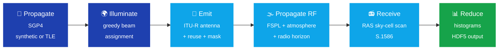
```mermaid
flowchart LR
    A[📡 Propagate<br/><sub>SGP4<br/>synthetic or TLE</sub>]:::geom
      --> B[🌍 Illuminate<br/><sub>greedy beam<br/>assignment</sub>]:::geom
      --> C[📶 Emit<br/><sub>ITU-R antenna<br/>+ reuse + mask</sub>]:::rf
      --> D[🌫️ Propagate RF<br/><sub>FSPL + atmosphere<br/>+ radio horizon</sub>]:::rf
      --> E[📻 Receive<br/><sub>RAS sky-cell scan<br/>S.1586</sub>]:::rf
      --> F[📊 Reduce<br/><sub>histograms<br/>HDF5 output</sub>]:::out
    classDef geom fill:#1e40af,color:#fff,stroke:#1e40af
    classDef rf fill:#0ea5e9,color:#fff,stroke:#0ea5e9
    classDef out fill:#16a34a,color:#fff,stroke:#16a34a
```

The received power per sky pointing is

$$
P_{\mathrm{rx}} \;=\; \sum_{\mathrm{sat,\;beam}} \frac{\mathrm{EIRP}_{\mathrm{tx}} \cdot G_{\mathrm{rx}}(\gamma) \cdot A_{\mathrm{atm}}(\mathrm{el})}{4 \pi r^{2}}
$$

summed over every visible satellite, every active beam, and every
reuse slot that overlaps the RAS receiver band.

> [!TIP]
> If you only need to **inspect existing HDF5 results** or **author
> configurations** — no simulation — the GUI runs fine on any platform
> without a CUDA GPU (see the [CPU-only conda env](#installation--three-conda-environments)).

Outputs include EPFD and PFD distributions, per-beam and per-satellite
aggregate power statistics, elevation-binned heatmaps, beam-demand time
series, and more — all available as raw time series, pre-accumulated
histograms, or postprocess recipes (CCDF, overlays, hemisphere maps).

The engine is **GPU-accelerated** via CuPy + Numba CUDA and scales to
mega-constellation workloads on consumer NVIDIA hardware. The **desktop
GUI** (PySide6) drives everything interactively, and the same simulation
API is importable into notebooks.

### Two complementary workflows

SCEPTer grew out of two distinct radio-astronomy-interference use cases
and ships a module set for each, on top of a shared geometry / orbit
foundation:


```mermaid
flowchart TB
    subgraph shared[🛰️ Shared geometry &#x2F; orbit foundation]
        S1[skynet<br/><sub>satellite propagation,<br/>geometry, visibility</sub>]
    end
    shared --> A[🧪 ITU-R EPFD studies]
    shared --> B[🔭 Practical radio astronomy]

    subgraph A[🧪 ITU-R EPFD studies &nbsp;·&nbsp; Simulation Studio GUI]
        direction LR
        A1[scenario<br/><sub>orchestration</sub>]
        A2[gpu_accel<br/><sub>CUDA engine</sub>]
        A3[scepter_GUI<br/><sub>PySide6 GUI</sub>]
        A4[earthgrid<br/>antenna<br/>custom_antenna<br/><sub>geometry &amp; patterns</sub>]
        A5[postprocess<br/>_recipes<br/>visualise<br/><sub>outputs</sub>]
    end

    subgraph B[🔭 Practical radio astronomy &nbsp;·&nbsp; Jupyter notebooks]
        direction LR
        B1[obs<br/><sub>observation<br/>simulation</sub>]
        B2[array<br/><sub>baseline<br/>geometry</sub>]
        B3[uvw<br/><sub>uv-plane<br/>tracks</sub>]
        B4[tlefinder<br/><sub>TLE archive<br/>discovery</sub>]
    end
    classDef root fill:#0f172a,color:#e2e8f0,stroke:#475569
    classDef lhs fill:#1e40af,color:#fff,stroke:#1e3a8a
    classDef rhs fill:#be185d,color:#fff,stroke:#9f1239
    classDef sub fill:#0c4a6e,color:#e0f2fe,stroke:#075985
    class shared,S1 sub
    class A,A1,A2,A3,A4,A5 lhs
    class B,B1,B2,B3,B4 rhs
```

- **ITU-R EPFD studies** (left) — regulatory-style EPFD / PFD
  calculations for non-geostationary constellations, driven by the
  **Simulation Studio** desktop GUI (or its Python API). This is the
  dominant workflow documented in the rest of this README.
- **Practical radio astronomy** (right) — time-domain observation
  simulation, uv-plane analysis, and baseline-level interference
  inspection, driven from **Jupyter notebooks** (see the
  [Notebook workflow](#notebook-workflow--the-low-level-engine)
  section).
- **Shared foundation** — `skynet` (satellite propagation and
  geometry) sits under both workflows, so any constellation you
  propagate once is available to either entry point.

---

## Quick start

### Installation — three conda environments

All packages come from `conda-forge`. Pick the environment that matches
your use case:

| Use case | File | Env name | GPU required? |
|:---|:---|:---|:---:|
| Standard — simulation + GUI + postprocess | `environment.yml` | `scepter-dev` | ✅ |
| Full — adds Cartopy + Trame (notebook-embedded PyVista 3D) | `environment-full.yml` | `scepter-dev-full` | ✅ |
| CPU-only — GUI + HDF5 inspection + postprocess (no runs) | `environment-cpu.yml` | `scepter-dev-cpu` | ❌ |

<details>
<summary><b>Standard install (click to expand)</b></summary>

```bash
conda env create -f environment.yml
conda activate scepter-dev
conda develop .
```
</details>

<details>
<summary><b>Full install with Cartopy + Trame</b></summary>

```bash
conda env create -f environment-full.yml
conda activate scepter-dev-full
conda develop .
```
</details>

<details>
<summary><b>CPU-only install (macOS / Linux-without-NVIDIA / Windows-without-CUDA)</b></summary>

```bash
conda env create -f environment-cpu.yml
conda activate scepter-dev-cpu
conda develop .
```

> [!NOTE]
> In the CPU-only environment the desktop GUI still opens and stays
> fully functional for editing configurations, inspecting saved HDF5
> results, and rendering postprocess recipes — only the **Run
> Simulation** button is disabled, and a one-shot dialog explains why.
</details>

### Running the desktop GUI

```bash
conda activate scepter-dev
python gui.py
```

### Running from notebooks

The `notebooks/` directory bundles Jupyter walkthroughs for the
classical (pre-GPU) observation workflow:

- `notebooks/observation simulation demo v0.0.1.ipynb` — end-to-end
  single-RAS observation using `skynet` + `obs`
- `notebooks/observation simulation demo v0.0.1 oneweb.ipynb` — same
  workflow applied to a OneWeb-like constellation
- `notebooks/Onsala simulation.ipynb` — single-station worked example
- `notebooks/grid generation.ipynb` — sky-cell grid construction
- `notebooks/fringe_simulation.ipynb` — interferometric fringe
  attenuation analysis

For the GPU direct-EPFD pipeline (the main engine behind the Run
Simulation button), the fastest path is the Simulation Studio GUI; the
Python API documented below works equally well from a notebook cell.

---

## Tutorial — your first simulation

This walkthrough produces a 10-minute EPFD estimate at a single
Radio Astronomy Service station, from a 200-satellite synthetic LEO
constellation. It takes **~15 s end-to-end** on a mid-range GPU.

**You will:**

- [x] Build a 200-satellite LEO constellation from a belt template
- [x] Pick a service mode and power quantity
- [x] Pick an antenna model
- [x] Place a RAS station and configure sky pointings
- [x] Choose frequency reuse and the emission mask
- [x] Run the simulation end-to-end
- [x] Render a CCDF of the resulting EPFD

### 1. Build the constellation

```python
from astropy import units as u
from scepter import tleforger

belts = [
    {
        "belt_name": "Shell_A",
        "num_sats_per_plane": 20,
        "plane_count": 10,
        "altitude": 525 * u.km,
        "eccentricity": 0.0,
        "inclination_deg": 53.0 * u.deg,
        "argp_deg": 0.0 * u.deg,
        "RAAN_min": 0 * u.deg,
        "RAAN_max": 360 * u.deg,
        "min_elevation": 20 * u.deg,
        "adjacent_plane_offset": True,
    },
]
tleforger.reset_tle_counter()
tles = tleforger.forge_tle_constellation_from_belt_definitions(belts)
# 200 TLEs, 10 orbital planes × 20 sats per plane, 53° inclination
```

The constellation layout looks like this (full walker constellation
visualised):

<p align="center">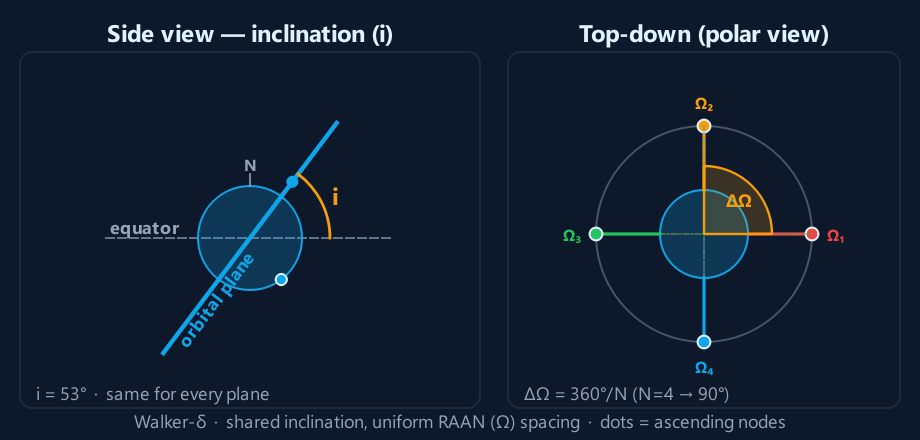</p>

### 2. Pick a service mode and power quantity

The satellite side can either **illuminate specific Earth cells** with
directive beams (one per beam, aimed at the cell centre) or emit
**isotropic unwanted radiation** (UEMR, a simple per-satellite power
level). Pick the one that matches your study.

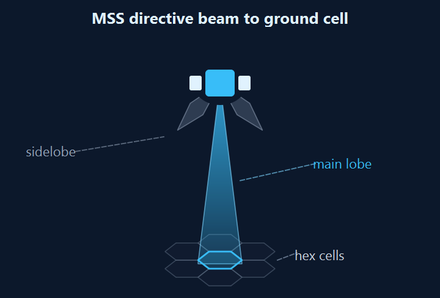
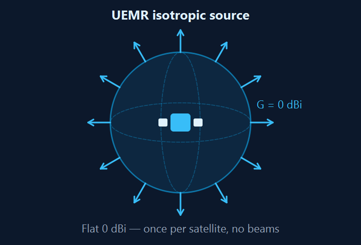

Each beam's transmitted power is set by ONE of four equivalent quantities
— SCEPTer converts internally so you only enter one:

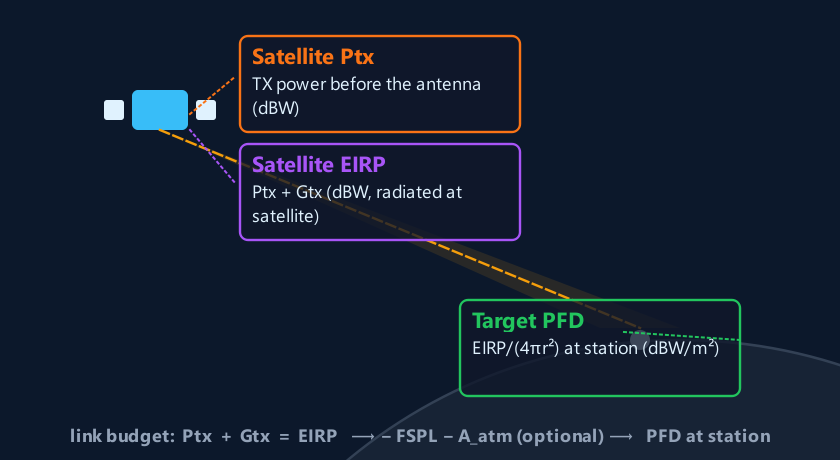

### 3. Pick an antenna model

ITU-R patterns are built in; you can also load your own as an LUT:

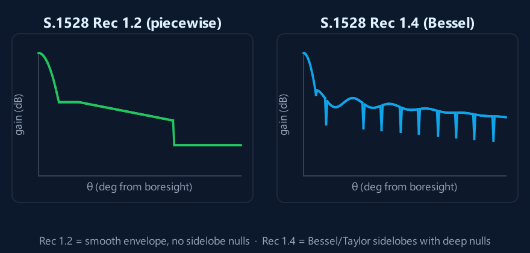

The runtime uses a precomputed LUT (fast) or a live analytical
evaluation (exact) depending on the **pattern evaluation mode**:

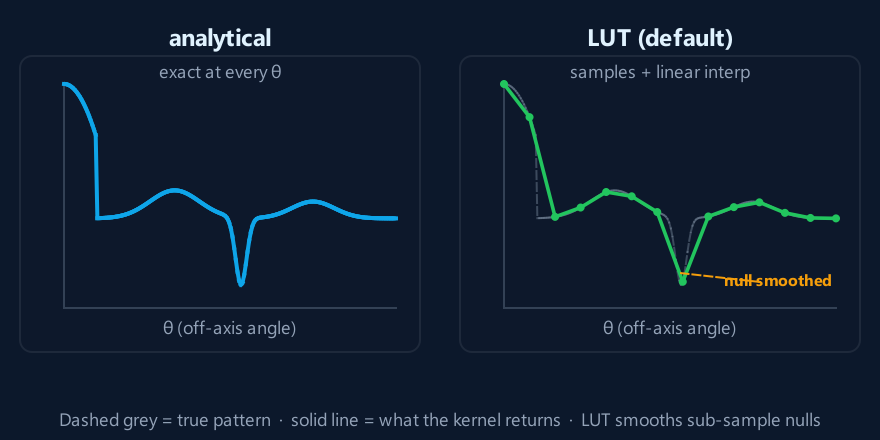

### 4. Place a RAS station and pick pointings

The RAS station's operational elevation range determines which sky
pointings its S.1586 scan generator visits:

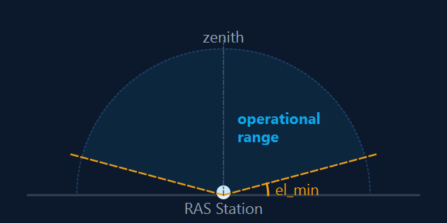
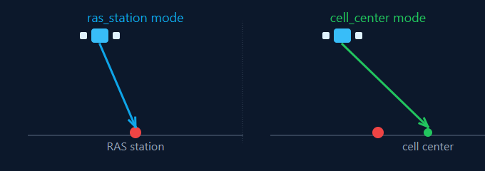

### 5. Choose frequency reuse and spectrum

Every satellite beam slots into one reuse-factor-N partition of the
service band; the mask shape controls out-of-band leakage into the RAS
channel:

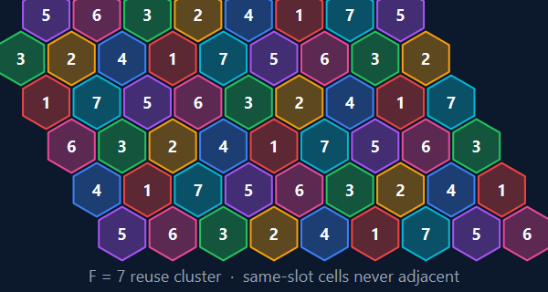
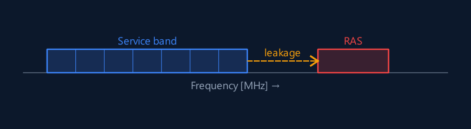

### 6. Run it from Python

Save a GUI project config once via the GUI, then:

```python
from scepter import scenario

summary = scenario.run_gpu_direct_epfd(
    **scenario.build_direct_epfd_run_request_from_gui_config(
        "my_project.json",
    ),
)
print(summary["storage_filename"])  # HDF5 path with the results
```

> [!IMPORTANT]
> ``run_gpu_direct_epfd`` **requires** a CUDA GPU. On a
> non-GPU machine you can still load the resulting HDF5 from a previous
> run and render postprocess recipes — only the simulation step itself
> needs the GPU.

### 7. Render a CCDF

```python
from scepter import postprocess_recipes as pp

fig, _info = pp.render_recipe(
    summary["storage_filename"],
    recipe_id="epfd_distribution",
    engine="matplotlib",
)
fig.savefig("epfd_ccdf.png", dpi=150)
```

---

## Key concepts

### Constellation geometry

A SCEPTer constellation is a sum of **belts** (rings of satellites on
identical orbital-element templates). Each belt has a plane count,
satellites per plane, altitude, inclination, and eccentricity. The
`tleforger` module emits synthetic TLEs that SGP4 propagates through
the simulation window.


Real-world constellations can be loaded as-is from TLE files (e.g. from
CelesTrak) — both paths feed the same simulation pipeline.

### Antenna patterns

Five built-in ITU-R pattern families plus user-supplied LUTs:

- **S.1528 Rec 1.2** (axisymmetric, taper-parameterised)
- **S.1528 Rec 1.4** (symmetric `lt=lr` and asymmetric `lt≠lr`
  rectangular apertures)
- **M.2101** phased-array composite
- **S.672** (GSO; circular-beam variant routes to Rec 1.2)
- **RA.1631** (RAS receiver side)
- **Custom 1-D** (axisymmetric `G(θ)` LUT from a JSON file)
- **Custom 2-D** (`G(θ, φ)` or `G(az, el)` LUT)


Custom patterns implement the `scepter_antenna_pattern_format=v1` schema
— see the `scepter.custom_antenna` module docstring for the authoritative
format. The same pipeline accepts them end-to-end: 3-D non-boresight,
4-D boresight-avoidance, both surface-PFD cap modes, and the spectral-
slab hoist.

### Service mode — UEMR vs directive

Two competing models of how a satellite distributes power:

- **Directive** — each active beam illuminates one specific Earth cell
  with a steerable directive pattern. Total radiated power divides
  among active beams. Matches how conventional FSS/MSS systems
  operate.
- **UEMR (isotropic)** — every satellite radiates a fixed isotropic
  unwanted-emission power, independent of beams. Matches the
  worst-case assumption for interference modelling of new
  (non-beamforming) emission classes.


### Power input quantities

A service is defined by **one** of four equivalent per-beam power
quantities; SCEPTer converts internally:

- `P_tx` (dBW per MHz)
- EIRP (dBW per MHz)
- Target PFD at Earth surface (dBW/m²/MHz)
- PFD at RAS station (dBW/m²/MHz)


### Frequency reuse and spectrum layout

Each beam lives in one of `N` frequency slots; reuse factor controls how
many beams can be co-frequency on nearby cells. Emission masks (SM.1541
FSS / MSS, user-custom) shape out-of-band leakage into the RAS channel.


### RAS pointing and elevation range

The RAS receiver's S.1586 scan covers a set of sky cells at fixed
elevation rings — the **operational elevation range** decides which
rings are active. The pointing mode selects whose line-of-sight
centres the scan (e.g. the RAS station itself, or each visible
satellite direction):


### Radio horizon and atmospheric loss

Two physically-realistic refinements over a pure vacuum / geometric
horizon model, both toggleable:

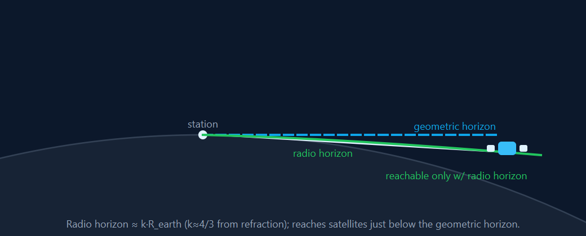

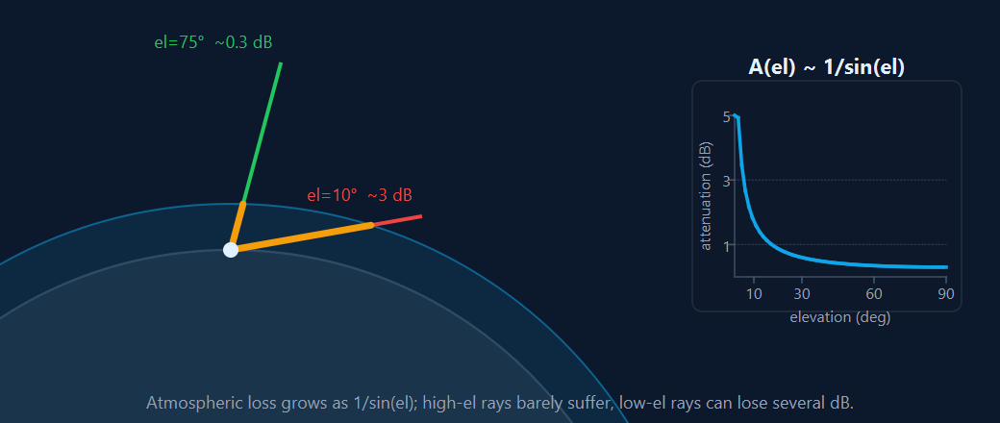

The radio horizon replaces the hard geometric cut at elevation 0° with
a frequency-dependent refraction-adjusted cut:

$$
\theta_{\mathrm{min}} \;\approx\; -\underbrace{0.57^{\circ}}_{\text{tropo, P.834}} \;-\; \underbrace{\frac{25}{f_{\mathrm{GHz}}^{2}}\mathrm{[deg]}}_{\text{iono (TEC-scaled)}}
$$

so low-elevation satellites just below the geometric horizon still
contribute. Atmospheric absorption uses ITU-R P.676[^p676] and grows as
$A \propto 1/\sin(\mathrm{el})$ along the slant path — looked up from a
compact GPU LUT at runtime.

> [!NOTE]
> Both default **off** for faster baseline debugging; turn them on for
> physically complete production runs. Expect a few-percent timing
> overhead when on — the LUT lookups are fused into the main power
> kernel.

### Boresight avoidance

RAS telescopes avoid pointing directly at satellites. SCEPTer supports
configurable angular exclusion zones around every satellite, and
retargets the scan onto the nearest valid sky cell when the chosen
pointing is inside an exclusion cone:

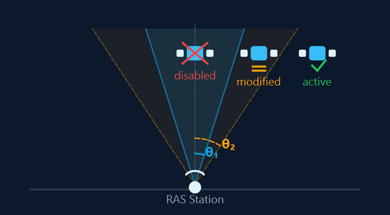

The 4-D `(time, sky, sat, beam)` boresight-avoidance path is
GPU-fused end-to-end with dedicated trig + EIRP kernels.

### Surface-PFD cap

Optional per-beam or per-satellite-aggregate cap that bounds the peak
PFD any beam (or all beams of a satellite combined) can deposit on
Earth's surface. Enables ITU-compliant "max PFD at surface" studies.

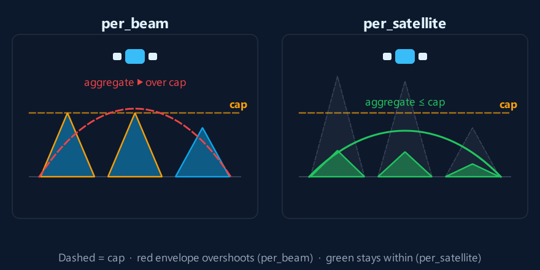

| Mode | Overhead | When to use |
|:---|:---:|:---|
| **Off** | 0 % | Uncapped reference runs |
| **Per-beam** | ≈ 1 % | One bounded beam at a time |
| **Per-satellite aggregate** | ≈ 4–5 % | Coincident-beam configurations |

> [!IMPORTANT]
> Per-beam caps bound individual beam EIRP from above — simple and
> cheap, but **does not bound the sum** if a satellite fires many
> beams at the same cell. Use per-satellite aggregate when coincident
> beams are possible.

### Pattern evaluation mode

Pattern gains can be looked up from a precomputed LUT (fast — default)
or re-evaluated analytically every time (exact — for verification
runs):


The S.1528 1-D LUT uses 180,000 entries at 0.001° resolution — 720 KB
fp32 or 360 KB fp16 — with typical accuracy < 0.01 dB vs the
analytical evaluator.

---

## Simulation Studio — the desktop GUI

The Simulation Studio is the primary interactive entry point. It bundles
every tab that defines a simulation — constellation, RAS, antenna,
service, spectrum, coverage, runtime — plus a live constellation viewer,
a hexgrid cell-status analyser, and a postprocess studio that renders
any HDF5 result with a library of recipes.

Every control in the Studio has an inline **"?" help popup** linked to
its meaning; most of the schematic images embedded above in this README
are the same ones the popups display. Click the little question mark
next to any label in the GUI to see the relevant diagram +
explanation.

> [!TIP]
> Inside pattern-editor dialogs, <kbd>Ctrl</kbd>+<kbd>Z</kbd> undoes
> the last edit and <kbd>Ctrl</kbd>+<kbd>Shift</kbd>+<kbd>Z</kbd> (or
> <kbd>Ctrl</kbd>+<kbd>Y</kbd>) redoes. <kbd>F1</kbd> opens the
> context-sensitive help popup for the focused control.

### Top-level workspaces

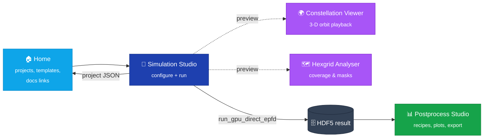
```mermaid
flowchart LR
    H[🏠 Home<br/><sub>projects, templates,<br/>docs links</sub>]:::home
    S[🧪 Simulation Studio<br/><sub>configure + run</sub>]:::studio
    V[🌍 Constellation Viewer<br/><sub>3-D orbit playback</sub>]:::view
    A[🗺️ Hexgrid Analyser<br/><sub>coverage &amp; masks</sub>]:::view
    P[📊 Postprocess Studio<br/><sub>recipes, plots, export</sub>]:::post

    H --> S
    S -->|project JSON| H
    S -->|run_gpu_direct_epfd| HDF[(🗄️ HDF5 result)]:::out
    HDF --> P
    S -. preview .-> V
    S -. preview .-> A

    classDef home fill:#0ea5e9,color:#fff,stroke:#0284c7
    classDef studio fill:#1e40af,color:#fff,stroke:#1e3a8a
    classDef view fill:#a855f7,color:#fff,stroke:#7e22ce
    classDef post fill:#16a34a,color:#fff,stroke:#15803d
    classDef out fill:#334155,color:#fff,stroke:#1e293b
```

| Workspace | Purpose |
|---|---|
| **Home** | Recent projects, quick-launch templates, documentation links |
| **Simulation Studio** | Full configuration + Run Simulation; nine left-rail tabs described below |
| **Constellation Viewer** | 3-D interactive PyVista view of Earth + orbits + RAS station; rotate / zoom / step through time |
| **Hexgrid Analyser** | Cell-status maps showing visibility, activity, eligibility masks, reuse-slot assignment; launches as a worker thread so the main GUI stays responsive |
| **Postprocess Studio** | Recipe-driven plotting from any HDF5 result file — CCDFs, heatmaps, overlays, per-beam and per-satellite traces, PNG export |

### Simulation Studio — tab-by-tab

The workflow runs top-to-bottom; each tab exposes an in-GUI status
indicator (ready / needs-review / blocked) so you can tell at a glance
what still needs attention.

#### 1. RAS Station

Where the radio telescope sits and what band it observes. Fields:
latitude / longitude / altitude, receiver-band start and stop in MHz,
station name. Placement is validated end-to-end: latitudes are wrapped
and sanity-checked, altitude has a cap, and frequency ordering is
enforced.

#### 2. Satellite System Mode

Pick between **Directive (cell illumination)** and **UEMR (isotropic
per-satellite)** emission models. The rest of the UI adapts — UEMR
mode hides beam-library parameters because they don't apply.


Optional **UEMR random power variation** adds a per-satellite
per-timestep uniform-random `U(0, P_tx)` factor to the isotropic
emission, modelling stochastic unwanted radiation.

#### 3. Satellite Orbitals

The belt editor. One row per orbital belt (altitude, inclination, plane
count, satellites per plane, eccentricity, RAAN range, min elevation,
adjacent-plane offset). Add, duplicate, delete, and reorder rows.
You can also load a TLE file directly for real-world constellations.


Below the belt table: a **total-satellite counter** that updates as you
edit, plus an "Add satellites per plane / plane count" helper that back-
computes from a target satellite count.

#### 4. Satellite Antennas

Select one of six ITU-R antenna models (or a custom LUT). The panel
swaps to match — rec 1.2 shows ``G_m / L_n / z``; rec 1.4 adds the
``lt / lr`` aperture axes; M.2101 exposes the element-pattern and array
parameters; S.672 routes to rec 1.2 with a circular-beam variant;
Isotropic shows nothing (0 dBi); Custom 1-D / 2-D gets its own page
with Load / Edit / Clear / Preview buttons.


The **Edit pattern** dialog opens a dedicated 1-D or 2-D editor with
live preview, plug-in template library (S.580-6, S.1428-1, SA.509-3,
F.1336-5 omnidirectional, F.1336-5 sectoral, Airy/jinc, cos-tapered
rectangular aperture, Gaussian, generic starter), Normalise… control,
and JSON Import / Export. Loaded patterns are byte-stable through
dump → load → dump.

Satellite and RAS both have a separate **Pattern evaluation** setting:


#### 5. Service & Demand

The per-beam power definition. Pick ONE of four equivalent
representations; SCEPTer converts internally:


Also configured here:
- `Nco` (number of co-frequency beams per sat)
- `Nbeam` (total active beams per sat)
- Selection strategy (nearest / greedy / load-balanced)
- Target elevation range where beams are eligible
- Optional **Surface-PFD cap** (off / per-beam / per-satellite
  aggregate) with limit in dBW/m²/MHz or dBW/m²/channel


In **UEMR mode** the whole Service & Demand panel collapses to a single
"service-band power" field (Ptx or EIRP) — the beam library is bypassed
so co-frequency count, beam count, and selection strategy don't apply.

#### 6. Spectrum & Reuse

Service band, frequency reuse scheme, TX emission mask, and RAS receiver
response. Every subsystem here is optional — set what your study
cares about and leave the rest.


Reuse factors from F1 (every beam on every channel) through F7 are
built in; set the **anchor slot** and optional **split rule** for how
a beam that straddles channels distributes its power. The **Edit Tx
Mask** dialog ships SM.1541 FSS and MSS templates, a custom point-
editable mask, and JSON Import / Export. The **RAS receiver response**
editor works the same way for the receive side.

#### 7. Coverage & Contours (hex grid)

The cell grid that tiles Earth for beam illumination. Controls:
geography mask (none / oceans-included / land-only) with shoreline
buffer, cell spacing override, cell-spacing rule (footprint-diameter
vs spacing-contour), RAS-station-vs-satellite pointing mode, and
coverage analyser controls.


The **Run Analyser** button kicks off a background worker that
computes the recommended cell spacing based on the antenna's footprint
at a user-selectable gain threshold (any **dBX** level — 3 dB, 10 dB,
or anything you specify) and the chosen spacing rule; the main UI
stays responsive while it runs.

Optional **shoreline buffer** (configured in
[Coverage & Boresight](#8-coverage--boresight)) keeps nearshore cells
in the grid when you're masking to ocean-only or land-only; a positive
buffer extends the effective land edge into the sea (keeping nearshore
sea cells), a negative buffer erodes the land edge inland:

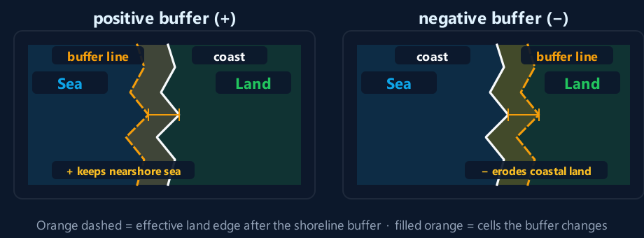

#### 8. Coverage & Boresight

Optional angular exclusion zones around each satellite — used to
model realistic RAS pointing avoidance (don't point directly at
satellites). Scope choices: per-cell IDs, per-cell layers, or a
radius in km. The ``theta1`` / ``theta2`` angles (inner / outer
cone) set how aggressively nearby sky cells get retargeted.


The **exclusion zone** around the RAS cell can be defined by a layer
count (hex-grid neighbours) or a radius in km; the GUI displays the
shaded exclusion footprint on the hex grid:

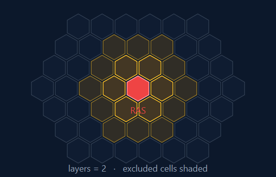

The 4-D `(time, sky, sat, beam)` boresight-avoidance path is a first-
class GPU kernel with dedicated fused trig + EIRP kernels — enabling
boresight adds ~5 % overhead at steady-state.

#### 9. Review & Run

Runtime settings, storage filename, and the **Run Simulation** button.
Memory budgets (GPU VRAM / host RAM), precision profile (float32,
float64, mixed), atmosphere toggle, radio-horizon toggle, and
advanced scheduler knobs all live here.


The **Run Monitor** panel on the right shows live batch progress,
stage breakdowns (propagate / library / finalize / power / export /
write), checkpoint counts, write-queue depth, and GPU
utilisation / VRAM sampling.

On machines **without a CUDA runtime** the Run Simulation button is
automatically disabled and a persistent banner explains why; the rest
of the Studio (config editing, HDF5 inspection, postprocessing) stays
fully functional.

### Constellation Viewer

A PyVista 3-D view of Earth with the satellite constellation
orbiting, RAS station marked, and boresight exclusion cones drawn
around each satellite (if enabled). Step through time with the
scrub bar; orbit / zoom / rotate with the mouse. Launch from the
workspace switcher in the left rail.

### Hexgrid Analyser

A 2-D Robinson / Mercator / Cartopy projection of Earth overlaid with
the current hex grid. Each cell is coloured by a configurable
status: **visibility** (sats above min-elevation), **activity**
(beams assigned), **eligibility** (beam-cap permits), **reuse slot**
(which frequency partition owns the cell). Useful for sanity-checking
coverage gaps or RAS-boresight exclusion before running a long
simulation. The analyser runs as a worker thread — the GUI stays
interactive while long computations run.

### Postprocess Studio

Open any HDF5 result file (from the GUI or from a notebook run) and
render it via a **recipe**. Recipes come in three families:

- **Distributions** — input-power CCDF, EPFD CCDF, per-satellite PFD
  CCDF, total PFD CCDF, ``4 × ΔT / T`` lines, ITU-R protection
  thresholds, RA.769 overlays.
- **Hemisphere / heatmap** — Prx-vs-elevation heatmap,
  per-satellite-PFD-vs-elevation heatmap, beam statistics
  per-satellite and aggregate, beam demand over time.
- **Overlay comparisons** — load multiple result files in one dialog,
  overlay their CCDFs, compare across precision profiles or scheduler
  settings, export the comparison PNG.

Every recipe has parameter controls (integration window, windowing
mode, bandwidth view, comparisons, smoothing) and a **Save PNG**
button that writes the rendered figure to disk.

---

## Notebook workflow — the low-level engine

The GUI is a front-end over a self-contained Python API that you can
drive directly from notebooks or scripts. Two flavours:

- **Direct-EPFD pipeline** (same engine the GUI uses) — GPU-native, all
  the modelling choices above expressed as ``run_gpu_direct_epfd``
  kwargs. Output is an HDF5 file.
- **Classical observation pipeline** (``skynet`` + ``obs``) — a CPU-
  first, interferometry-aware workflow built around pycraf + cysgp4.
  Useful for detailed single-scan interference analysis with UVW
  fringe attenuation, dish-gain models, and sky-tracking geometry.
  Precedes the GPU engine historically and remains available.

Most users start from the GUI, but the notebook path is worth knowing
for custom studies — you get to mix and match modules that the GUI
doesn't expose.

### Observation simulation with `skynet` + `obs`

This is the original SCEPTer workflow, pre-dating the GPU pipeline.
It's a good fit for detailed single-pass interferometry studies or
pedagogical walk-throughs.

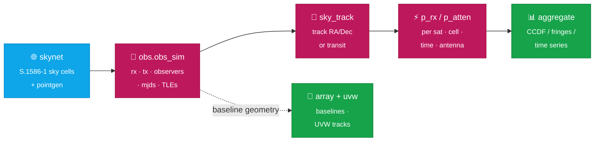
```mermaid
flowchart LR
    SK[🌐 skynet<br/><sub>S.1586-1 sky cells<br/>+ pointgen</sub>]:::geom
      --> OB[🔭 obs.obs_sim<br/><sub>rx · tx · observers<br/>· mjds · TLEs</sub>]:::rf
      --> TR[📡 sky_track<br/><sub>track RA/Dec<br/>or transit</sub>]:::rf
      --> PW[⚡ p_rx / p_atten<br/><sub>per sat · cell ·<br/>time · antenna</sub>]:::rf
    OB -. baseline geometry .-> UV[🧮 array + uvw<br/><sub>baselines ·<br/>UVW tracks</sub>]:::out
    PW --> AGG[📊 aggregate<br/><sub>CCDF / fringes /<br/>time series</sub>]:::out

    classDef geom fill:#0ea5e9,color:#fff,stroke:#0284c7
    classDef rf fill:#be185d,color:#fff,stroke:#9f1239
    classDef out fill:#16a34a,color:#fff,stroke:#15803d
```

```python
import numpy as np
from astropy import units as u
from pycraf import conversions as cnv
from scepter import skynet, obs
from cysgp4 import PyObserver

# --- Step 1: sky-cell pointings via ITU-R S.1586-1 ---
tel_az_deg, tel_el_deg, grid_info = skynet.pointgen_S_1586_1(
    niters=3,                           # random samples per retained cell
    rnd_seed=42,
    elev_range=(10 * u.deg, 90 * u.deg),
)
# tel_az / tel_el: (3, 1734) at (10-90°) = subset of the 2334-cell grid

# --- Step 2: observer(s) + time grid ---
observers = [PyObserver(116.6 * u.deg, -26.7 * u.deg, 377 * u.m)]  # MWA
mjds = 60000.0 + np.linspace(0, 1/24, 60)  # 60 minutes at 1-min cadence

# --- Step 3: receiver + transmitter ---
rx = obs.receiver_info(
    d_rx=6 * u.m, eta_a_rx=0.7, pyobs=observers,
    freq=1420 * u.MHz, bandwidth=10 * u.MHz,
)
tx = obs.transmitter_info(
    p_tx_carrier=10 * cnv.dBW,
    carrier_bandwidth=125 * u.kHz,
    duty_cycle=1.0, d_tx=0.5 * u.m, freq=1420 * u.MHz,
)

# --- Step 4: wire up the simulation ---
sim = obs.obs_sim(rx, {"tel_az_deg": tel_az_deg, "tel_el_deg": tel_el_deg}, mjds)
sim.populate(my_tle_list)                  # list of PyTle objects
sim.sky_track(ra=0 * u.deg, dec=45 * u.deg)  # track a specific direction

# --- Step 5: evaluate received power per (sat, sky cell, time, antenna) ---
tx.power_tx(rx.bandwidth)
ang_sep = sim.sat_separation(mode='tracking')
g_rx = rx.antgain1d(sim.pnt_az, sim.pnt_el, sim.topo_pos_az, sim.topo_pos_el)
prx = obs.prx_cnv(tx.fspl(sim.topo_pos_dist), g_rx)  # W, shape (obs, pnt, sky, epoch, nint, sat)
```

#### What each module covers

| Module | Focus |
|---|---|
| `scepter.skynet` | Sky-cell sampling (S.1586-1 grid), cadence helpers (`plantime`), grid-aware plotting (`plotgrid`). Includes both the current official S.1586-1 grid and a legacy equal-area `pointgen` for backwards compatibility. |
| `scepter.obs` | Per-observer / per-pointing / per-satellite power accounting with antenna patterns, FSPL, atmospheric terms, and interferometer-specific extras — `baseline_bearing`, `baseline_vector`, `mod_tau`, `baseline_nearfield_delay`, `fringe_attenuation`, `bw_fringe`. Complete for single-link or dish-array studies. |
| `scepter.obs.transmitter_info` | Satellite-side class: carrier EIRP, bandwidth, duty cycle, dish diameter, freq; gives you `power_tx()`, `fspl()`, and `eirp()` helpers. |
| `scepter.obs.receiver_info` | RAS-side class: dish diameter, aperture efficiency, pyobserver(s), band. Offers `antgain1d` (RA.1631-style) and coordinate conversions. |
| `scepter.obs.obs_sim` | The orchestrator — propagates satellites, resolves each antenna's sky-tracking geometry, and exposes the 6-D data cube `(obs, pnt, sky, epoch, nint, sat)`. |

Refer to the module docstrings for the authoritative parameter list —
both files are heavily annotated with ITU-R recommendation references
and usage examples.

### Lower-level / specialised helpers

Not everything goes through `obs_sim` or `run_gpu_direct_epfd`. A few
modules expose composable primitives that advanced users and tests
leverage directly:

| Module | When to use |
|---|---|
| `scepter.tleforger` | Synthetic TLE generation from belt templates — great for `what-if` scenarios without downloading CelesTrak. |
| `scepter.earthgrid` | Hex-grid construction, footprint geometry, land-mask resolution. Use `prepare_active_grid` + `resolve_theta2_active_cell_ids` to build your own coverage studies. |
| `scepter.nbeam` | Beam-cap sizing analysis with visibility-aware pooling policies — tail-risk, SLA-δ, SLA-ε metrics. Decide how many active beams per sat make sense for a given outage tolerance. |
| `scepter.satsim` | Pure-Python reference greedy-beam assigner — used by tests and for CPU verification of the GPU pipeline. |
| `scepter.visualise` | Matplotlib plots: CDF / CCDF, hemisphere maps, cell-status maps, threshold lines. The GUI uses these via `postprocess_recipes`. |
| `scepter.uvw` | Radio-interferometer UVW coordinates and fringe-aware helpers. Used in advanced tracking analyses. |
| `scepter.angle_sampler` | Angular sampling utilities (angle-space importance sampling); used internally by the spectrum normaliser and some postprocess recipes. |
| `scepter.custom_antenna` | Load / validate / dump user-supplied LUT antenna patterns (schema v1). Pure-Python + NumPy — no GUI or GPU dependency. |
| `scepter.analytical_fixtures` | Sample any built-in analytical pattern onto a chosen grid and produce a `CustomAntennaPattern`. Handy for building ITU LUTs from the analytical formulas. |
| `scepter.custom_antenna_preview` | Matplotlib figure factory for loaded patterns. Embed-ready in any Qt canvas; runs headless for testing. |

### Benchmark helpers

```python
from scepter import scenario

# Single-configuration benchmark — five timestep values, two memory budgets
summaries = scenario.benchmark_direct_epfd_runs_from_gui_config(
    "benchmark_config.json",
    timestep_values_s=(30.0, 10.0, 5.0, 2.0, 1.0),
    memory_budget_pairs_gb=[(16.0, 4.0), (32.0, 12.0)],
    profile_stages=True,            # emit per-batch stage timing events
    sample_live_gpu_metrics=True,   # sample GPU util / VRAM at ~4 Hz
)
# summaries: list of dicts with per-run metrics, stage breakdown, GPU metrics
```

### Direct GPU propagation

For advanced users who need raw positions + AZ/EL without the full
EPFD pipeline:

```python
import numpy as np
from scepter import gpu_accel

session = gpu_accel.GpuScepterSession(
    compute_dtype=np.float32,
    sat_frame="xyz",
)
sat_ctx = session.prepare_satellite_context(tles, method="vallado")
obs_ctx = session.prepare_observer_context(observers)

with session.activate():
    result = session.propagate_many(
        mjds, sat_ctx,
        observer_context=obs_ctx,
        do_topo=True, do_sat_azel=True,
    )
session.close(reset_device=False)

# result contains topocentric (az, el, range) for every (time, observer, sat),
# plus the satellite body-frame az/el for each satellite at every timestep.
```

The session object is the single GPU context for a run — contexts
(satellite, observer, pattern, spectrum) are uploaded once and reused
across batches.

---

## API reference and code examples

### Belt definition and TLE generation

```python
from astropy import units as u
from scepter import tleforger

belt_definitions = [
    {
        "belt_name": "LEO_Shell_1",
        "num_sats_per_plane": 120,
        "plane_count": 28,
        "altitude": 525 * u.km,
        "eccentricity": 0.0,
        "inclination_deg": 53.0 * u.deg,
        "argp_deg": 0.0 * u.deg,
        "RAAN_min": 0 * u.deg,
        "RAAN_max": 360 * u.deg,
        "min_elevation": 20 * u.deg,
        "adjacent_plane_offset": True,
    }
]
tleforger.reset_tle_counter()
constellation = tleforger.forge_tle_constellation_from_belt_definitions(
    belt_definitions,
)
# 3,360 TLEs
```

### Standalone GPU propagation

```python
import numpy as np
from scepter import gpu_accel

session = gpu_accel.GpuScepterSession(
    compute_dtype=np.float32,
    sat_frame="xyz",
)
sat_ctx = session.prepare_satellite_context(tles, method="vallado")
obs_ctx = session.prepare_observer_context(observers)

with session.activate():
    result = session.propagate_many(
        mjds, sat_ctx,
        observer_context=obs_ctx,
        do_topo=True, do_sat_azel=True,
    )
session.close(reset_device=False)
```

### Running a direct-EPFD batch from a GUI config

```python
from scepter import scenario

kwargs = scenario.build_direct_epfd_run_request_from_gui_config(
    "project.json",
    timestep_s=5.0,             # optional override
    gpu_memory_budget_gb=8.0,   # optional override
)
summary = scenario.run_gpu_direct_epfd(**kwargs)
```

### Benchmark across timestep and memory ladders

```python
summaries = scenario.benchmark_direct_epfd_runs_from_gui_config(
    "benchmark_config.json",
    timestep_values_s=(30.0, 5.0, 1.0),
    memory_budget_pairs_gb=[(16.0, 4.0), (32.0, 12.0)],
)
```

### Loading a custom antenna pattern

```python
from scepter import custom_antenna as ca

pattern = ca.load_custom_pattern("my_antenna.json")
print(pattern.kind, pattern.peak_gain_dbi, pattern.gain_db.shape)

# Sample any analytical pattern onto a dense LUT:
from scepter import analytical_fixtures as af
import numpy as np

pat = af.sample_analytical_1d(
    af.ra1631_evaluator(diameter_m=25.0, wavelength_m=0.15),
    np.linspace(0, 180, 181),
    peak_gain_dbi=55.0,
)
ca.dump_custom_pattern("ra1631_25m_1p4ghz.json", pat)
```

### Rendering a postprocess recipe

```python
from scepter import postprocess_recipes as pp

fig, info = pp.render_recipe(
    "run_output.h5",
    recipe_id="prx_elevation_heatmap",
    engine="matplotlib",
    params={"bandwidth_view_mode": "channel_total"},
)
fig.savefig("prx_vs_elevation.png", dpi=150)
```

---

## Architecture

### Simulation pipeline (per batch)

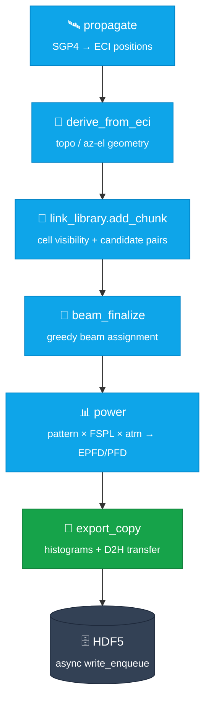
```mermaid
flowchart TD
    P[🛰️ propagate<br/><sub>SGP4 → ECI positions</sub>]:::stage
      --> D[📐 derive_from_eci<br/><sub>topo / az-el geometry</sub>]:::stage
      --> L[🔗 link_library.add_chunk<br/><sub>cell visibility + candidate pairs</sub>]:::stage
      --> B[🎯 beam_finalize<br/><sub>greedy beam assignment</sub>]:::stage
      --> W[📊 power<br/><sub>pattern × FSPL × atm → EPFD/PFD</sub>]:::stage
      --> X[💾 export_copy<br/><sub>histograms + D2H transfer</sub>]:::exp
      --> H[(🗄️ HDF5<br/><sub>async write_enqueue</sub>)]:::out
    classDef stage fill:#0ea5e9,color:#fff,stroke:#0284c7
    classDef exp fill:#16a34a,color:#fff,stroke:#15803d
    classDef out fill:#334155,color:#fff,stroke:#1e293b
```

<details>
<summary><b>Stage-time profile</b> — click to expand</summary>

Typical per-batch steady-state wall-time share on GPU:

| Stage | Typical share |
|:---|---:|
| `power` | ~45 % |
| `cell_link_library` | ~30 % |
| `beam_finalize` | ~20 % |
| `export_copy` | a few % |
| `propagate` | a few % |

The exact numbers vary with GPU model, scenario size, and precision
profile; the engine is tuned so no single stage dominates at the
expense of the others.
</details>

### Core modules — by workflow

#### Shared foundation

| Module | Responsibility |
|--------|----------------|
| `scepter.skynet` | Satellite propagation, S.1586 sky-grid, geometry, visibility |
| `scepter.angle_sampler` | Angular sampling utilities |

#### ITU-R EPFD studies (Simulation Studio GUI + GPU engine)

| Module | Responsibility |
|--------|----------------|
| `scepter.scepter_GUI` | Desktop GUI (PySide6 + PyVista) — Simulation Studio |
| `scepter.scenario` | Simulation runner, memory-aware scheduler, HDF5 I/O, benchmark helpers |
| `scepter.gpu_accel` | GPU session, propagation, pattern evaluation, power accumulation |
| `scepter.earthgrid` | Hex-grid generation, footprint geometry, land masking |
| `scepter.antenna` | Analytical ITU-R antenna patterns |
| `scepter.custom_antenna` | User-supplied LUT patterns (schema v1) |
| `scepter.analytical_fixtures` | Sample any analytical pattern onto a LUT |
| `scepter.custom_antenna_preview` | Pure-matplotlib preview factory for loaded patterns |
| `scepter.visualise` | Matplotlib plots — CDF/CCDF, hemisphere maps, cell-status maps |
| `scepter.postprocess_recipes` | Recipe-driven HDF5 result rendering |
| `scepter.tleforger` | Synthetic TLE constellation generation |
| `scepter.satsim` | CPU satellite link selection and beam assignment |
| `scepter.nbeam` | Beam-cap sizing analysis (tail-risk / SLA-delta / SLA-epsilon) |

#### Practical radio astronomy (notebook workflow)

| Module | Responsibility |
|--------|----------------|
| `scepter.obs` | Observation-simulation pipeline for a single telescope |
| `scepter.array` | Interferometer-array baseline geometry helpers |
| `scepter.uvw` | Radio-interferometer UVW-coordinate helpers |
| `scepter.tlefinder` | TLE-archive discovery and time-indexed lookup |

### Shared library helpers

```python
from scepter import earthgrid, scenario, visualise

earthgrid.summarize_contour_spacing(...)
earthgrid.prepare_active_grid(...)
earthgrid.resolve_theta2_active_cell_ids(...)
visualise.plot_cell_status_map(...)
scenario.build_observer_layout(...)
scenario.run_gpu_direct_epfd(...)
```

## GPU and hardware requirements

| Component | Minimum | Recommended |
|:---|:---|:---|
| GPU | NVIDIA, Compute Capability ≥ 7.0 (Volta+) | RTX 3080 / 4080 or better |
| VRAM | 4 GB | 12+ GB for 3k+ satellite constellations |
| Host RAM | 16 GB | 32+ GB for heavy multi-system runs |
| CUDA drivers | Installed at system level | Use the `environment.yml` CUDA toolkit |

> [!TIP]
> Memory budget tuning: pass `gpu_memory_budget_gb` /
> `host_memory_budget_gb` to `run_gpu_direct_epfd` when a game or
> another workload is sharing the GPU. The built-in scheduler adapts
> `bulk_timesteps` and `cell_chunk` to fit.

### Performance characteristics

| Feature | Overhead vs. baseline |
|:---|:---|
| Boresight avoidance (4-D exclusion-cone pipeline) | a few % |
| Surface-PFD cap (per-beam) | ≈ free |
| Surface-PFD cap (per-satellite aggregate) | a few % |
| Custom 2-D LUT | ≈ same as M.2101 directive path |

Steady-state throughput depends heavily on GPU model, VRAM budget, and
scenario size; the engine is tuned to scale linearly across satellites,
beams, and sky cells on consumer NVIDIA hardware.

---

## Testing

```bash
pytest --basetemp=.pytest-tmp -v
```

Targeted runs:

```bash
pytest scepter/tests/test_scenario.py -v            # simulation logic
pytest scepter/tests/test_gui.py -v                 # GUI (requires PySide6)
pytest scepter/tests/test_custom_antenna.py -v      # custom-pattern schema
pytest scepter/tests/test_surface_pfd_cap.py -v     # surface-PFD cap
pytest scepter/tests/test_multi_system.py -v        # multi-system HDF5 merge
```

GPU tests are automatically skipped when no CUDA device is available.

### Parallel testing

```bash
pytest -n auto --dist loadgroup   # auto-detect CPU count
```

GPU tests are grouped to run sequentially on one worker; CPU-only tests
spread across all workers.

---

## Contributing

- `AGENTS.md` — repository-wide code-quality and review rules
- `.github/copilot-instructions.md` — AI-assistant generation rules
- `CHANGELOG.md` — what changed between releases

When making dependency changes, keep `environment.yml`,
`environment-full.yml`, `environment-cpu.yml`, `requirements.txt`, and
`setup.py` aligned.

---

## License and attributions

SCEPTer is distributed under the **GNU General Public License v3.0 or
later** (GPLv3+). See [`LICENSE`](LICENSE) for the full text.

Third-party dependency notices live in
[`THIRD_PARTY_NOTICES.md`](THIRD_PARTY_NOTICES.md); bundled licence
texts are in the [`LICENSES/`](LICENSES/) directory.

### Development tooling

Large portions of the simulation pipeline, GUI, and test infrastructure
were co-developed with AI coding assistants — primarily **OpenAI
Codex** and **Anthropic Claude** — under human direction and review.
The repository-wide rules those assistants follow are defined in
[`AGENTS.md`](AGENTS.md). All merged code is reviewed for correctness,
ITU-R compliance, and numerical accuracy before release.

### Repository

- Original: <https://github.com/hqiu-nju/scepter>
- Active migration target: SKAO GitLab (in progress)

### References

[^p676]: ITU-R P.676 — Attenuation by atmospheric gases and related effects.
[^s1528]: ITU-R S.1528 — Satellite antenna radiation patterns for non-geostationary orbit (non-GSO) satellites.
[^m2101]: ITU-R M.2101 — Modelling and simulation of IMT networks and systems.
[^ra1631]: ITU-R RA.1631 — Reference radio astronomy antenna pattern.
[^s1586]: ITU-R S.1586 — Methodology for EPFD calculations between non-GSO fixed-satellite service systems and RAS stations.
[^ra769]: ITU-R RA.769 — Protection criteria used for radio astronomical measurements.

<div align="center">

---

<sub>Made with ☕ + 🛰️ + 📡 at the SKA Observatory</sub>

</div>
